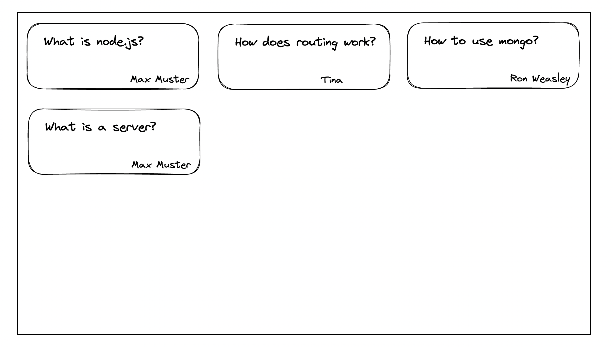

# User Story 1

## Value statement

As a user
I need **a list of question cards**
so that I can see most important questions.

## Description (Text, Scribble, Wireframe, Design)

Mobile version:

Desktop version:

## Acceptance criteria

- List of cards
- Text/question
- Author

## Tasks

- Create feature branch
- Create Card component
- Write component tests
- Add components to app (feature implementation with state)
- Add missing styles

## Complexity

low
