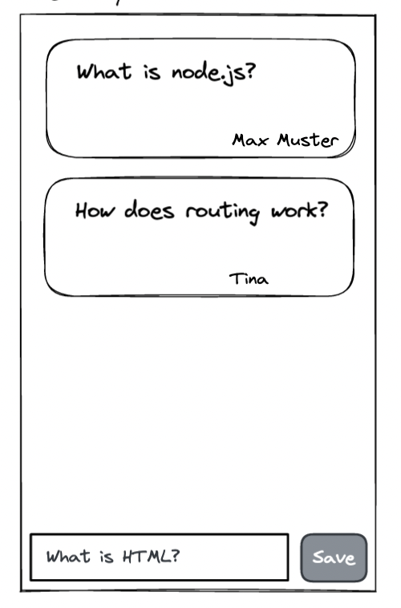
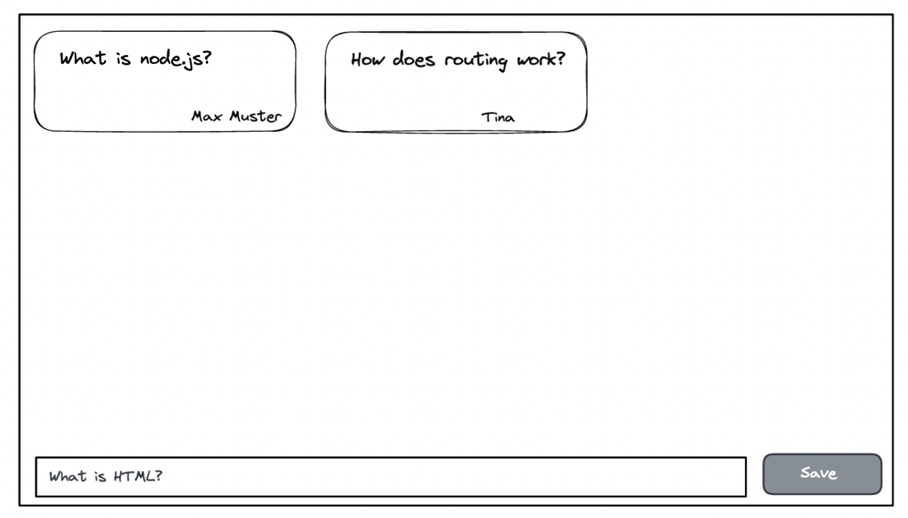

# User Story 2

## Value statement

As a user
I need **an input element**
so that I can add a new question.

## Description (Text, Scribble, Wireframe, Design)

Mobile version:

Desktop version:

## Acceptance criteria

- Input element
- Button
- Hidden label for input

## Tasks

- Create feature branch
- Create Input component
- Create Button component
- Write component tests
- Add components to app (feature implementation with state)
- Add missing styles

## Complexity

medium
