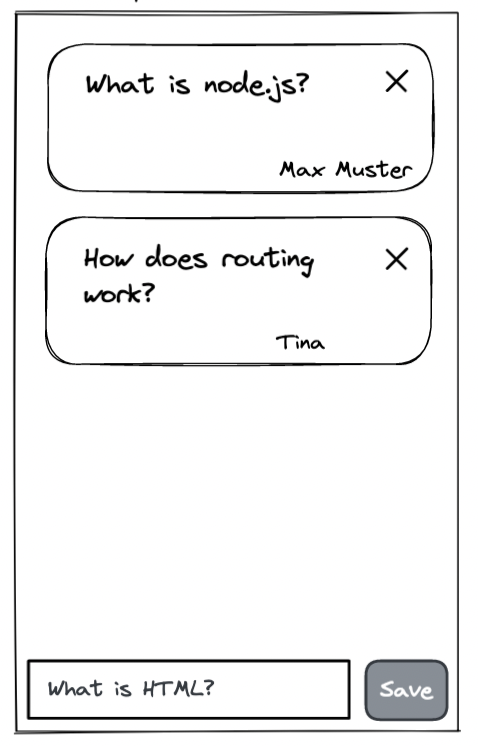
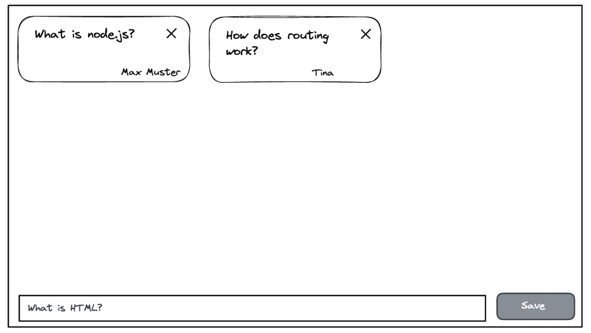

# User Story 4

## Value statement

As a user
I need **delete a question**
so that I can control which ones I want to keep.

## Description (Text, Scribble, Wireframe, Design)

Mobile version:

Desktop version:

## Acceptance criteria

- Each card gets a delete button or icon
- Card will be deleted on click

## Tasks

- Create feature branch
- Create delete functionallity in Card component
- Update component tests
- Add missing styles

## Complexity

high
