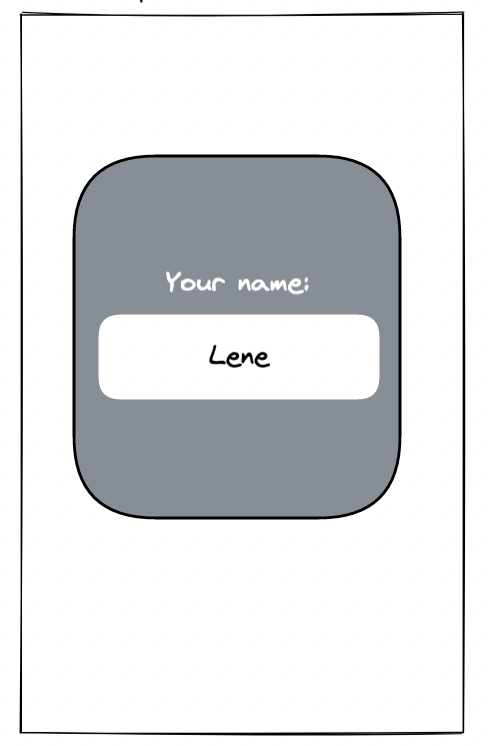
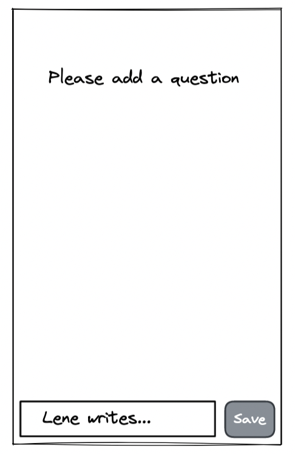
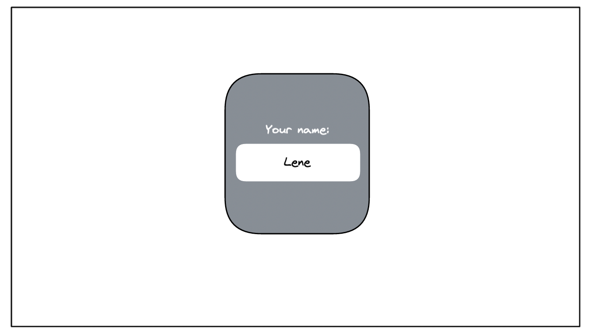
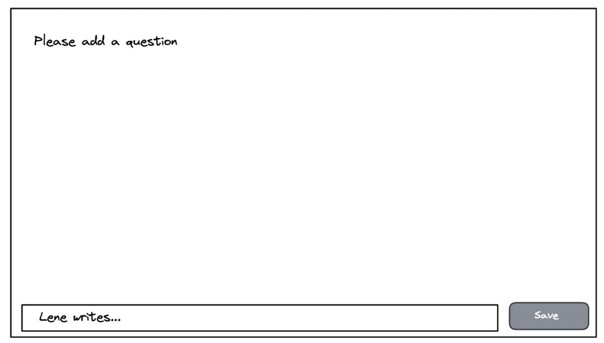

# User Story 5

## Value statement

As a user
I need **a login to add my name**
so that I can see which card I created.

## Description (Text, Scribble, Wireframe, Design)

Mobile version:

Desktop version:

## Acceptance criteria

- User needs to submit his name
- After name is submitted it should be stored locally
- Should be a logout button
- Board should be available only after login

## Tasks

- Create feature branch
- Write Login component
- Write Logout component
- Update component tests
- Add missing styles

## Complexity

very high
